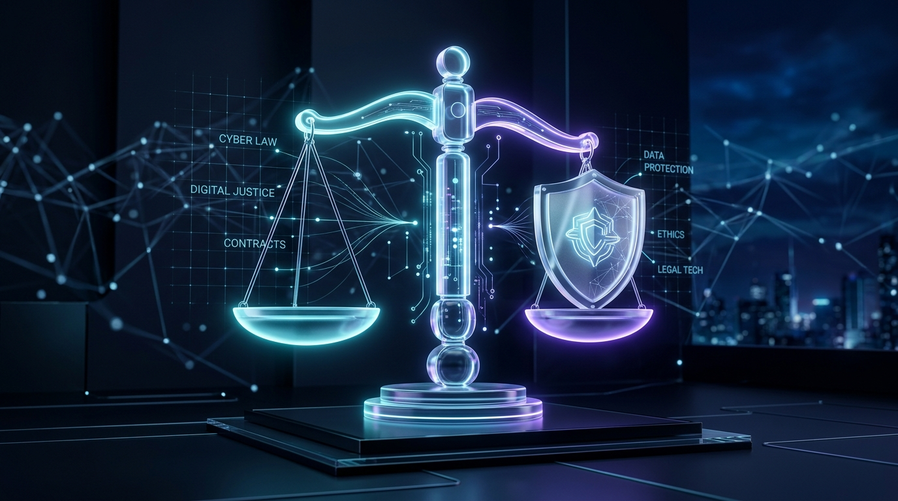

# ⚖️ LexiGuard AI — GenAI Legal Document Intelligence & Navigation Suite

[](https://opensource.org/licenses/MIT)
[](#-privacy--security-shield)
[](#-key-features)
[](#-dual-ai-engine)
[](#-visual-interface)

> **Demystify complex legal documents, uncover hidden contractual traps, and take practical action — with bank-grade client-side privacy.**



---

## 🌟 Overview

Legal contracts, leases, and terms of service are notoriously dense, intimidating, and filled with legalese designed to protect the drafter. **LexiGuard AI** democratizes legal comprehension by acting as an intelligent, transparent legal co-pilot that helps everyday users, tenants, employees, and freelancers:

1. **Understand** their documents in plain, everyday English.
2. **Detect** one-sided clauses, harsh liquidated damages, and restrictive covenants before signing.
3. **Compare** counter-offers and contract versions side-by-side with differential risk shifts.
4. **Take Action** with automated dispute response letters, negotiation counter-scripts, and 1-page lawyer consultation prep packs.

---

## 🚀 Key Features

### 1. 🛡️ 100% Client-Side Privacy Shield & Zero Retention
- **Local-First Processing**: Documents are evaluated inside the user's browser session.
- **Automated PII Anonymizer**: Automatically detects and redacts personal identifiable information (**Names**, **Addresses**, **Phone Numbers**, **Emails**, **Monetary Values**) into safe tokens (`[NAME_1]`, `[FINANCIAL_VAL_1]`) prior to any processing.
- **1-Click Session Purge**: Instantly clear temporary memory and loaded contracts on demand.

### 2. ⚡ GenAI Risk Radar & SVG Score Gauge
- **Dynamic 0–100 Risk Meter**: Visual gauge with color-coded classification:
  - 🔴 **Red Flags (High Risk)**: Broad non-compete bans, full deposit forfeiture, unilateral contract modifications.
  - 🟡 **Watchouts (Moderate Risk)**: Strict 90-day certified mail renewal traps, high repair deductibles.
  - 🟢 **Standard Terms**: Mutual confidentiality, standard commercial dispute frameworks.
  - 🔵 **Actionable Commitments**: Payment schedules, notice milestones.

### 3. 🔍 Split-Screen Document Reader & Clause Lens
- **Synchronized Visual Navigation**: View the original contract text side-by-side with filterable AI clause analysis cards.
- **Interactive Jump-to-Line**: Clicking any clause card smoothly scrolls the document pane directly to the target clause and triggers a visual neon pulse highlight.

### 4. ⚖️ Side-by-Side Contract Comparison Matrix
- Compare original contracts against proposed counter-offers (e.g., Version A vs. Version B).
- Highlights added restrictions, removed protections, altered liabilities, and net risk score variations.

### 5. 💬 Grounded AI Legal Copilot
- Document-grounded interactive assistant for targeted queries (*"What is the cancellation notice period?"*, *"Who owns the intellectual property?"*, *"Are there late fees?"*).
- Provides plain-English answers backed by direct line and section citations.

### 6. 📋 Practical Action Center & Dispute Letter Suite
- **Key Dates & Obligations Timeline**: Tracks renewal deadlines, payment milestones, and grace periods.
- **Formal Dispute & Request Letter Generator**: Creates customizable formal letters (Lease Security Deposit Return Demand, Non-Compete Waiver Request, Contract Amendment Proposals).
- **1-Page Lawyer Consultation Prep Pack**: Printable summary equipped with key contract facts, identified red flags, and the top 5 targeted questions to ask an attorney.
- **Negotiation Counter-Offer Script Generator**: Provides fair alternative clause wording for counter-proposals.

---

## 🛠️ Tech Stack & Architecture

- **Frontend**: HTML5, Modern Vanilla ES6 Modules, CSS3 Glassmorphism with CSS Custom Properties.
- **Typography**: [Outfit](https://fonts.google.com/specimen/Outfit) (Display & Metrics), [Plus Jakarta Sans](https://fonts.google.com/specimen/Plus+Jakarta+Sans) (UI & Body), [JetBrains Mono](https://fonts.google.com/specimen/JetBrains+Mono) (Legal Code).
- **Icons & Visuals**: [Lucide Icons](https://lucide.dev/), Canvas Confetti, and custom 3D AI-rendered cyber-legal assets.
- **AI Processing**: Google Gemini API integration (`gemini-1.5-flash`) paired with a high-speed heuristic NLP fallback engine for zero-latency offline performance.
- **Server**: Lightweight Python HTTP Server (`server.py`).

---

## 📂 Project Structure

```
lexiguard-ai/
├── assets/
│   ├── hero_banner.jpg          # 3D Glassmorphic Legal Scales Hero Banner
│   └── privacy_shield.jpg       # Cyber-Legal Security Emblem Badge
├── js/
│   ├── app.js                   # Application State & UI Orchestrator
│   ├── components/
│   │   ├── ActionCenter.js      # Timeline, Formal Letters, Negotiation Scripts
│   │   ├── ApiKeyModal.js       # Gemini API Key Configuration
│   │   ├── ClauseLens.js        # Split-Screen Synchronized Clause Reader
│   │   ├── ContractComparator.js# Side-by-Side Dual Document Comparator
│   │   ├── Header.js            # Top Bar, Privacy Badge, Theme Switcher
│   │   ├── PrivacyShield.js     # PII Anonymizer & Session Purge Modal
│   │   ├── QACopilot.js         # Grounded AI Legal Chatbot
│   │   └── RiskOverview.js      # SVG Semi-Circle Animated Risk Gauge
│   ├── data/
│   │   └── samples.js           # 5 Pre-loaded Realistic Sample Agreements
│   └── services/
│       ├── aiEngine.js          # Gemini Live Client + Local NLP Engine
│       ├── exporter.js          # 1-Page Lawyer Prep Pack & File Exporter
│       └── piiMasker.js         # Client-Side PII Masking & Privacy Service
├── .gitignore                   # Standard Git Ignore configuration
├── index.html                   # Core HTML5 Frame
├── README.md                    # Project Documentation & Architecture
├── server.py                    # Zero-dependency Python Local Web Server
└── styles.css                   # Cyber-Legal Glassmorphic Design System
```

---

## ⚡ Getting Started

### Prerequisites
- Python 3.8+ (No external pip dependencies required!)

### Running Locally

1. **Clone the repository**:
   ```bash
   git clone https://github.com/<your-username>/lexiguard-ai.git
   cd lexiguard-ai
   ```

2. **Launch the local web server**:
   ```bash
   python server.py
   ```

3. **Open in browser**:
   Navigate to [http://localhost:8080](http://localhost:8080).

---

## 🔒 Privacy & Data Confidentiality

LexiGuard AI was built with a **security-first philosophy**:
- Contract documents uploaded or pasted into LexiGuard AI are handled in client-side memory.
- When live AI analysis is triggered, the built-in PII Anonymizer systematically substitutes names, phone numbers, emails, addresses, and dollar amounts with tokenized identifiers (`[NAME_1]`, `[FINANCIAL_VAL_1]`).
- Users can clear all loaded text and local storage at any time with the **"Purge Session"** button.

---

## ⚠️ Legal Disclaimer

> **IMPORTANT**: LexiGuard AI is an automated information and educational assistance tool designed to help users understand, organize, and navigate legal documents. **It does not provide formal legal advice, legal representation, or establish an attorney-client relationship.** Always consult a licensed attorney for situations requiring binding legal counsel.

---

## 📄 License

Distributed under the MIT License. See `LICENSE` for details.
